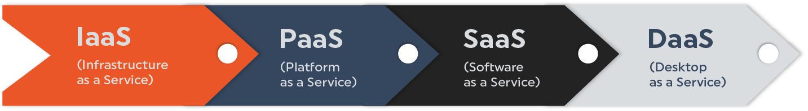
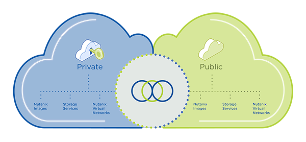
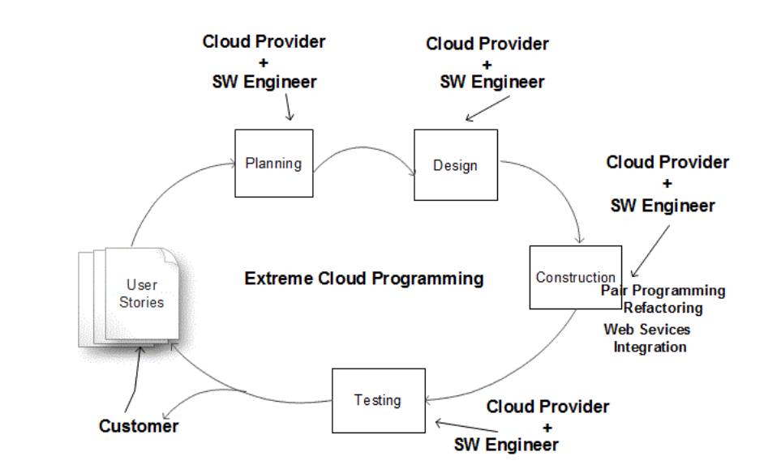
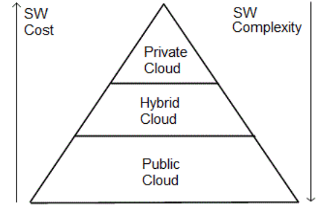

## 云计算对于软件开发的影响

## 什么是云计算
### 1. 发展背景
&emsp; 在大多数情况下，托管在组织内部的单片应用程序的时代已经结束了。在当今的开发世界中，应用程序趋向于去集中化和分解为可重用的服务。为了提高性能，应用程序不再以使用串行处理的方式开发，而是利用多线程和并行处理来提高性能速度和可伸缩性。花费数年时间进行大型更新和发布的趋势已经让位给更频繁、通常更小的更新。许多组织已经采用了持续集成和持续部署。
&emsp; 老派的开发人员投入了大量的时间来构建和测试解决方案，以确保它们不会失败。成功的度量是平均失败间隔时间(MTBF)。这已经让位于一种理解失败将会发生的心态，并因此专注于通过为失败设计来处理它。焦点已经从试图避免所有的错误和问题转移到度量修复可能发生的问题的平均时间(MTTR)。
&emsp; 云计算的出现以及云服务商提供的特性和服务，使这些开发领域的变化更加大胆。开发人员利用云的能力已经变得很容易，而且在大多数情况下，具有成本效益。
&emsp; 云计算基于Web 2.0的面向服务架构(service oriented architecture, SOA)以及硬件和软件资源的虚拟化。由于采用了虚拟化技术，物理资源可以动态链接到不同的应用程序上运行操作系统。由于采用了虚拟化技术，物理资源可以在所有用户之间共享，并且可以进行有效的资源管理，从而提供更高的资源利用率和随需应变的可伸缩性。资源利用率的提高降低了建筑面积成本以及电力和制冷成本。节能是云计算最吸引人的特点，也是当今环保绿色计算或绿色IT运动的新倡议。

### 2. 分类

&emsp; 根据共享和交付给客户的资源的不同，云计算有4种类型。在云计算术语中，当处理器、存储和网络等硬件作为服务交付时，称为基础设施即服务(IaaS)。IaaS的例子是Amazon的弹性云(EC2)和简单存储服务(S3)。当编程平台和工具如Java, Python, .net, MySQL和api作为服务交付时，它被称为平台即服务(PaaS)。当应用程序作为服务交付时，它被称为软件即服务(SaaS)。

&emsp; 根据租户对资源的自治理或控制程度，云有3种类型，如内部云或私有云、外部云或公共云和混合云。在私有云中，企业拥有现场的所有资源，并在多个资源之间共享应用程序。在公共云中，企业将从站点外的云服务商租用资源，这些资源将在多个租户之间共享。混合云处于中间位置，企业拥有一些资源，并从第三方租用一些其他资源。

## 云计算对软件工程带来的影响
&emsp; 在使用web服务和云平台的快速变化的计算环境中，软件开发将是非常具有挑战性的。软件开发过程将涉及到异构平台、分布式web服务、分散在世界各地的多个企业。现有的软件流程模型和框架活动是不够的，除非包括与云服务商的交互。
### 需求阶段
&emsp; 到目前为止，需求收集阶段涉及以下角色: 客户、用户和软件工程师。如今，需求收集阶段也必须包括云服务商，因为云服务商将提供和维护计算基础设施。由于云服务商只知道基础设施的规模、架构细节、虚拟化策略和资源利用率，所以软件开发的规划和设计阶段也必须包括云服务商。借助云服务商可以解决以下问题:1)开发人员数量评估 2)组件重用 3)成本估算，4)进度估算 5)风险管理 6)配置管理 7)变更管理，8)质量保证。
### 开发/测试阶段
&emsp; 由于web服务的组件重用，软件的规模(以千行代码(KLOC)或新开发的功能点(FP)的数量)将会减少，但由于缺少web服务及其集成需求的实现细节的文档，项目的复杂性将会增加很多倍。只有在线可用的描述是由计算机自动处理的web服务的元数据信息。
&emsp; 只有编码和测试阶段可以由软件工程师独立完成。编码和测试可以在云平台上完成，这是一个巨大的好处，因为每个人都可以方便地访问正在构建的软件。这将减少测试和验证的成本和时间。
&emsp; 但是软件开发者必须使用从云上免费获得的web服务和开源软件，而不是获取它们。软件开发人员应该在从现成的组件构建软件方面有更多的专业知识，而不是把所有的组件都写出来，然后构建一个独立的应用程序。需要对现有应用程序进行重构，以最有效地利用云基础架构。在最新的硬件技术中，计算机是多核和网络化的，软件工程师应该在并行和分布式计算方面进行训练，以补充硬件和网络技术的进步。软件工程师应该在internet协议、XML、web服务标准和internet SOA体系结构的分层分离方面进行培训，以充分利用web 2.0的所有好处。云服务商将坚持软件尽可能模块化，以便从一台服务器迁移到另一台服务器，以实现云服务商所要求的负载平衡。
### 维护阶段
&emsp; 维护阶段还应该包括云服务商。基础设施的维护责任从软件开发人员完全转移到了云服务商。现在，由于云服务商的参与，客户也必须与云服务商签订合同，以确保云服务商不违反“软件工程道德规范”。此外，数据的保护和安全是非常重要的，现在属于云服务商的管辖范围。
&emsp; 此外，应用程序对CPU时间或网络的偶尔较高资源使用率的要求，可能会使按使用付费的云计算模型陷入危险，因为多个应用程序可能同时需要较高的资源使用率，这是云服务商在开始时没有预料到的。特别是当应用程序部署为“软件即服务”或“SaaS”模型时，它们可能会出现事先没有预料到的偶尔的工作负载激增。
&emsp; 云服务商使用资源虚拟化技术以一种有效的方式满足许多客户的需求。为了提高资源利用率，云服务商可能需要偶尔将应用程序从一台服务器迁移到另一台服务器，或者从一个存储迁移到另一个存储。这可能会与客户产生利益冲突，因为客户希望他们的应用程序具有高可用性和可靠性的专用资源。为了避免这种冲突，云服务商需要为高优先级租户引入服务质量。

### 与云服务商交互的花费
&emsp; 现在我们来分析一下云服务商和软件工程师之间的交互有多难? 软件工程师和云服务商之间的交互数量将取决于云的类型，比如公共云、私有云和混合云。在私有云中，客户可以比在公共云中进行更多的控制或自我治理。客户还应该考虑使用私有云而不是公共云来确保高优先级应用程序的可用性和可靠性。私有云的好处在于与云服务商的交互较少、自治理、高安全性、可靠性和数据可用性[图5]。但是公共云上更便宜的计算总是会超过私有云平台上更简单的软件开发带来的好处，而且会更有吸引力。

## 总结
&emsp; 需求分析、设计、开发、测试和部署等所有阶段都需要与云服务商的代表进行交互。云服务商和软件开发人员的角色或活动是分开的。云平台上的资源核算将由云服务商在需求收集阶段进行。项目的软件架构、软件架构到硬件架构的映射、界面设计、数据类型设计、成本估算、进度估算等都需要与云服务商协同完成。在应用程序的构建阶段，如果集成了涉及许多不同企业的web服务，那么通过云服务商的中介可以减轻错误。与云服务商的维护合同将根据服务质量协议进行。