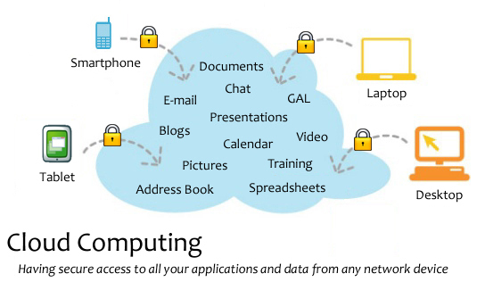
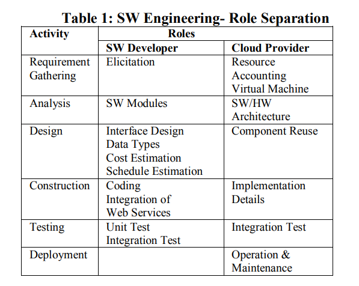

## 云计算对于软件开发的影响

## 第一章 背景

### 1.1 云计算发展背景

&emsp; 在当今的软件开发行业中，应用程序趋向于构建去中心化与分解为可重用的服务。为了提高性能，应用程序不再以使用串行处理的方式开发，而是利用多线程和并行处理来提高性能速度和可伸缩性。与以往的花费数年时间进行一次大型更新相比, 如今的发布的趋势已经让位给更频繁、通常规模更小的更新。许多公司与组织已经采用了可持续集成/交付(CI/CD)。
&emsp; 过去的开发人员投入了大量的时间来构建和测试解决方案，以确保程序不会失败。程序成功的度量是平均失败间隔时间(MTBF)。如今, 这中观点已经逐渐让位于一种理解失败将会发生的心态，并专注于通过为失败设计来处理它。焦点已经从试图避免所有的错误和问题转移到度量修复可能发生的问题的平均时间(MTTR)。
&emsp; 云计算的出现以及云服务商提供的特性和服务，使这些开发领域的变化更加大胆。开发人员利用云的能力已经变得很容易，而且在大多数情况下，具有成本效益。
&emsp; 云计算基于面向服务架构(service oriented architecture, SOA)以及硬件和软件资源的虚拟化。由于采用了虚拟化技术，物理资源可以动态链接到不同的应用程序上运行操作系统。由于采用了虚拟化技术，物理资源可以在所有用户之间共享，并且可以进行有效的资源管理，从而提供更高的资源利用率和随需应变的可伸缩性。资源利用率的提高降低了建筑面积成本以及电力和制冷成本。节能是云计算最吸引人的特点，也是当今环保绿色计算或绿色IT运动的新倡议。

### 1.2. 云计算分类

&emsp; 根据共享和交付给客户的资源的不同，云计算有4种类型。在云计算术语中，当处理器、存储和网络等硬件作为服务交付时，称为基础设施即服务(IaaS)。IaaS的例子是Amazon的弹性云(EC2)和简单存储服务(S3)。当编程平台和工具如Java, Python, .net, MySQL和api作为服务交付时，它被称为平台即服务(PaaS)。当应用程序作为服务交付时，它被称为软件即服务(SaaS)。

&emsp; 根据租户对资源的自治理或控制程度，云有3种类型，如内部云或私有云、外部云或公共云和混合云(图1)。在私有云中，企业拥有现场的所有资源，并在多个资源之间共享应用程序。在公共云中，企业将从站点外的云服务商租用资源，这些资源将在多个租户之间共享。混合云处于中间位置，企业拥有一些资源，并从第三方租用一些其他资源。

## 第二章 云计算对软件工程带来的影响

&emsp; 在使用网络服务和云平台的快速变化的计算环境中，软件开发将是非常具有挑战性的。软件开发过程将涉及到异构平台、分布式web服务、分散在世界各地的多个企业。现有的软件流程模型和框架活动是不够的，因此与云服务商的交互是不可或缺的。

### 2.1 需求/设计阶段

&emsp; 一般而言，需求收集阶段涉及以下角色: 客户、产品经理和软件工程师。如今，需求收集阶段也必须包括云服务商，因为云服务商将提供和维护计算基础设施; 然而在软件开发的规划和设计阶段, 由于云服务商对于基础设施的规模、架构细节、虚拟化策略和资源利用率具有一定了解，所以云服务商的参与也是不可缺少的。借助云服务商可以解决以下问题:1)开发人员数量评估 2)组件重用 3)成本估算 4)进度估算 5)风险管理 6)配置管理 7)变更管理 8)质量保证。

### 2.2 开发/测试阶段

&emsp; 由于网络服务的组件复用，软件工程师需要新开发的软件的代码行数（KLOC）或功能点数（FP）将减少，但由于缺乏网络服务的实现细节及其集成要求的文档，项目的复杂性将增加很多倍。 唯一可用的文档是通过框架或是其他途径自动生成的元数据文档, 可供参考的方面较少。
&emsp; 在软件开发的流程中只有编码和测试阶段可以由软件工程师独立完成。而编码和测试可以也可以借助云平台完成，这将为开发带来巨大的便捷，因为每位开发者都可以方便地访问正在构建的软件。这将减少软件测试与验证的成本和时间。
&emsp; 相比过去的开发者使用物理服务器的开发人员被限制在一台服务器上进行开发与测试，这会导致进程变慢, 可供模拟复杂环境的资源途径也较为欠缺。而在云上工作的开发者可以访问无限数量的服务器、虚拟服务器或云实例; 通过云端就加快了他们的工作效率。它们独立于物理服务器，可以继续工作。
&emsp; 开发需要多个项目管理、问题管理和自动化测试环境。这些服务大多以SaaS形式提供，包括Salesforce和Basecamp; 还有IaaS产品如AWS、aliyun、Tencent云等，以及PaaS实例如Oracle数据库云服务和谷歌应用引擎。通过这些云服务特别有助于提高开发效率。
&emsp; 但是软件开发人员必须使用从云端免费提供的网络服务和开源软件，而不是采购它们。软件开发人员应该拥有更多的专业知识，从现成的组件中构建软件，而不是编写所有的组件并构建一个单一的应用程序。为了以最具有成本效益的方式地利用云基础设施架构，需要对现有的应用进行重构。 由于如今的计算机是多核的而软件服务大多是网络化的，软件工程师应该训练自己在并行和分布式计算方面的能力，以补充硬件和网络技术的进步。云服务商会坚持认为，软件应该尽可能的模块化开发也就是将业务拆分成不同微服务，以便根据云服务商的要求，偶尔从一台服务器迁移到另一台服务器上进行负载均衡。
&emsp; 对于测试阶段, 云的一个优势在于能够创建多个环境，在云平台上，可以轻松地构建一个新环境，并隔离正在测试的代码版本。由于存在多个环境，可以根据不同功能创建不同环境一遍开发与测试, 这一优点允许多人同时处理代码的不同部分, 有助于开发效率的提高。
&emsp; 构建和自动化需要时间来开发。对于在自动化过程中没有产生正确结果的代码，团队将不得不反复编码和测试它们，直到看到想要的结果。随着大量虚拟机的出现，团队可以更快地修复错误。云计算加速了交付速度。因此，虚拟化增强了集成和交付。

###  2.3 维护阶段

&emsp; 维护阶段同样应该包括云服务商的参与。如今, 基础设施的维护责任从软件开发人员完全转移到了云服务商。由于云服务商的参与，客户也必须与云服务商签订合同，以确保云服务商不违反“软件工程道德规范”。比如数据的保护和安全，现在属于云服务商的管辖范围, 这也是需要通过合同约束的.
&emsp; 此外，应用程序对CPU时间或网络的偶尔较高资源使用率的要求，可能会使按使用付费的云计算模型陷入危险，因为多个应用程序可能同时需要较高的资源使用率，这是云服务商在开始时没有预料到的。特别是当应用程序部署为“软件即服务”或“SaaS”模型时，它们可能会出现事先没有预料到的偶尔的工作负载激增。
&emsp; 云提供商使用资源虚拟化技术，以高效的方式满足众多客户的需求。为了提高资源利用率，云提供商可能需要偶尔将应用程序从一台服务器迁移到另一台服务器或从一个存储设备迁移到另一个存储设备。这可能会与客户产生利益冲突，因为客户希望其应用具有高可用性和可靠性的专用资源。为了避免这种冲突，云提供商需要为高优先级租户引入服务质量条款。

### 2.4 交互的成本

&emsp; 虽然上述几个阶段阐述了云计算所带来的益处, 然而也应该重视与云服务商的交互成本。软件工程师和云提供商之间的互动量将取决于云的类型，如公有云、私有云和混合云的交互是不尽相同的。 在私有云中，客户比公有云有更多的控制或自我治理。客户也应该考虑使用私有云而不是公有云，以确保其高优先级应用的可用性和可靠性。私有云的好处是减少与云提供商的互动、自我治理、高安全性、可靠性、数据的可用性。但是，公有云上更便宜的计算总是会超过私有云平台上软件开发复杂性较低的好处，并且会更具吸引力。这不得不令人陷入两难, 通过引入云服务商以提高开发效率却又带来了额外的开销, 这使得软件开发项目更加复杂.

## 第三章 如何优化云服务的使用

&emsp; Radha Guha的文章[3]中提到了一种基于的COCOMO模型的敏捷过程模型，并将其命名为极限云编程。首先先介绍一下基础的COCOMO模型, 建设性成本估算模型（COCOMO）是各种SW开发项目成本估算中最常用的模型。COCOMO模型中，到目前为止已经考虑了三类SW项目。 这些软件工程项目根据SW团队的规模、经验和开发(HW、SW和运营)约束条件被分为1)有机型、2)半分离型、3)嵌入式。在基本的COCOMO模型中，努力(人月)、开发时间(月)和所需人数由以下公式给出。应用的工作量=a(KLOC)b[人月] , 开发时间=c(应用的工作量)d[月], 人数=应用的工作量/开发时间[人数] 。Radha Guha文中通过对比云服务项目与COCOMO模型中三类SW项目对比, 得出了以下结论云计算的系数a、b的确定使努力曲线比其他3个类别更陡峭，但与其他3个类别一样是线性的, 由于组件重用，用云计算进行SW开发将显著降低KLOC（千行代码), 并在30%的组件复用率时, 云计算平台上的SW开发所需时间最少。

&emsp; Jürgen Citod等人的文章[3]中通过调查了

## 第四章 总结

云计算是对传统软件开发和部署方式的一种范式转变。这将使软件工程变得更加困难，因为他们必须与被称为 "云提供商 "的第三方互动。开发软件所需的工作量将减少，但会增加与云提供商的沟通和协调要求，这使得软件的开发工作更加困难。
